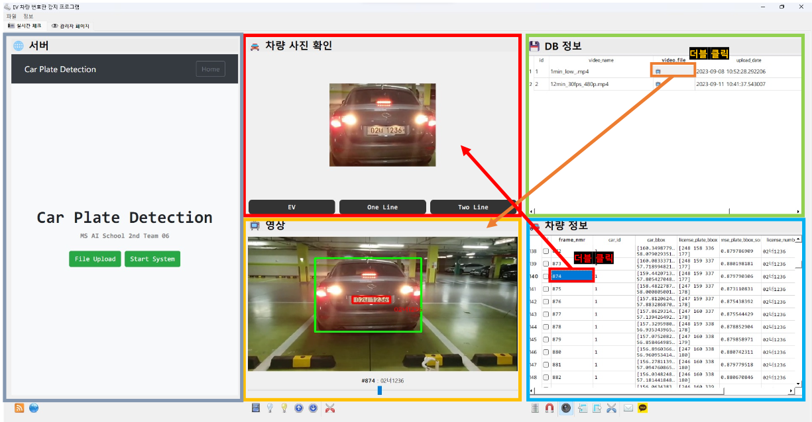
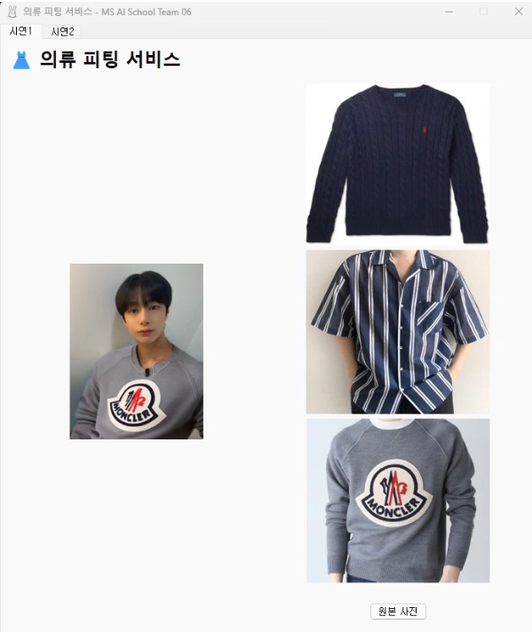

# Microsoft AI School

## 프로젝트 소개
- **[Project 1]** 전기 자동차 주차장에 있는 일반 차량 번호판 감지 관리자용 프로그램
- **[Project 2]** Stable Diffusion을 이용한 가상 의류 피팅 서비스 시연 프로그램

## 프로젝트 진행 기간
- `2023.08.21` - `2023.09.19`

## 구현 스택
- *Python*
- *PyQt5* (Front-end)
- *Flask* (Back-end)
- *SQLite3* (DB)
- *YOLOv8* (AI Modeling)

## 프로그램 실행 사진
<table>
    <tr>
        <th>Project 1</th>
        <th>Project 2</th>
    </tr>
    <tr>
        <td></td>
        <td></td>
    </tr>
</table>
